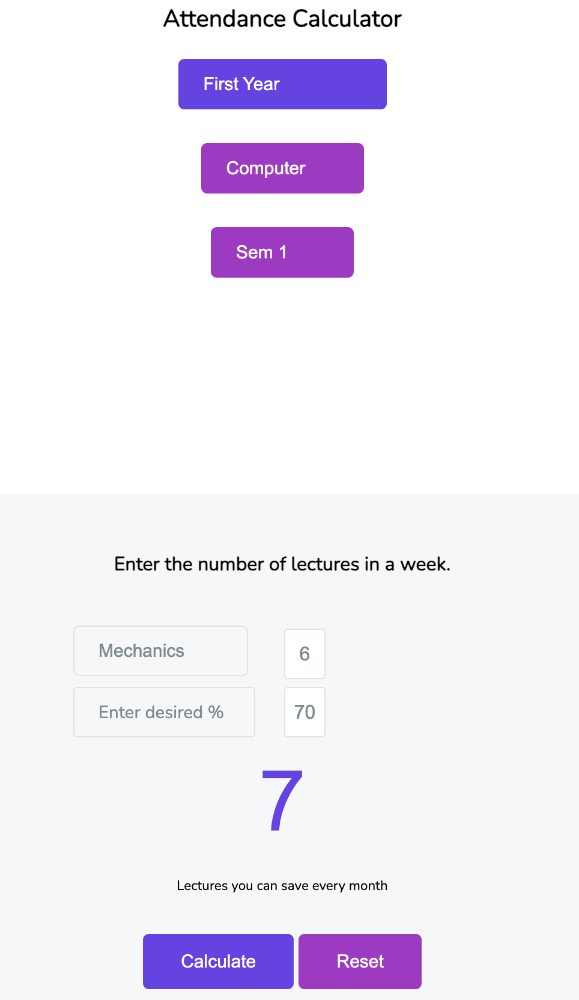

# Attendance Planner
This repository contains a web application built using HTML, CSS, and JavaScript specifically designed for brainheaters.in. The Attendance Planner allows users to calculate the number of lectures they cannot attend in a given month in order to achieve a desired percentage of attendance. The application provides a user-friendly interface to input the necessary information, including the year, subject, number of lectures per week, and the desired attendance percentage.

## Functionality
The Attendance Planner provides the following functionality:

- Selection of Year and Subject: Users can choose the specific year and subject for which they want to calculate the required number of lectures.
- Number of Lectures per Week: Users can input the number of lectures scheduled per week for the selected year and subject.
- Desired Attendance Percentage: Users can specify the desired attendance percentage they aim to achieve for the given month.
- Calculation of Required Lectures: Based on the provided inputs, the application calculates the number of lectures the user cannot attend in order to achieve the desired attendance percentage.

## Usage
To use the Attendance Planner web application. Once on this page, navigate to the Attendance Planner section. You will be presented with an interface where you can select the year, subject, number of lectures per week, and desired attendance percentage. After providing the necessary inputs, the application will calculate the required number of lectures for you.

Please refer to the code provided in this repository for further information on how to use and implement the Attendance Planner web application.

## User-interface

